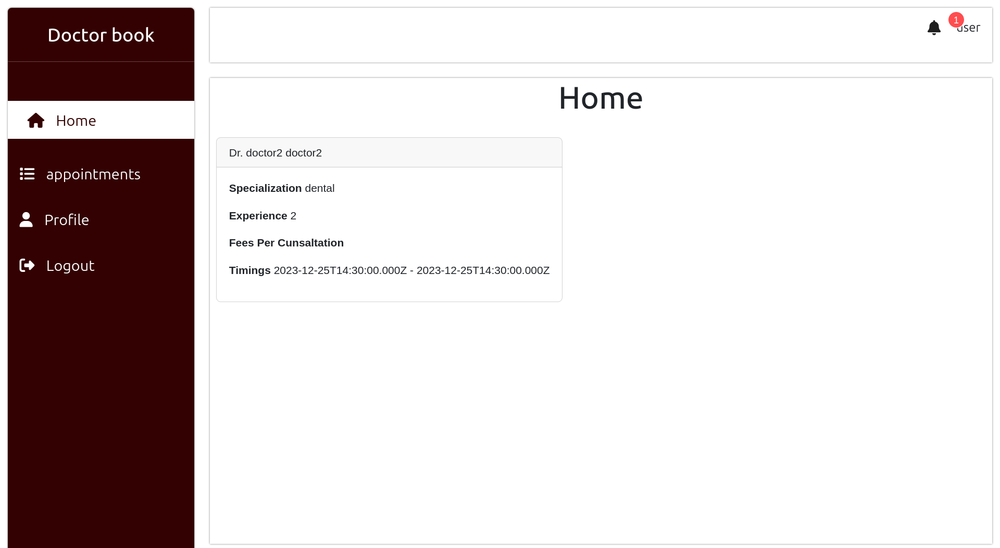
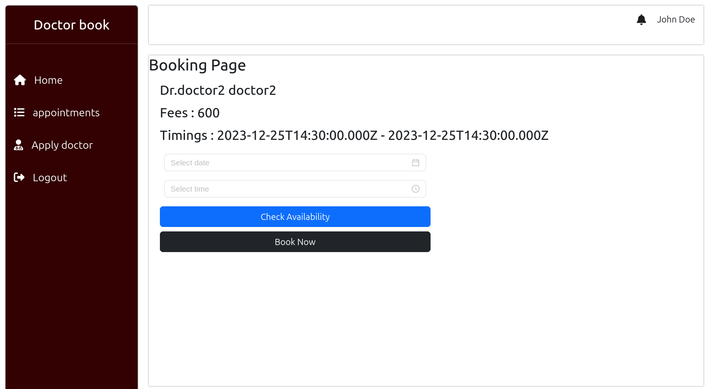
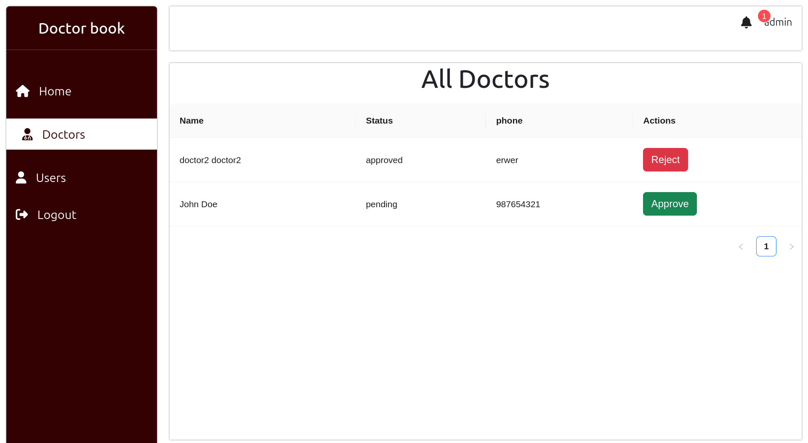

# Doctor Book - MERN Stack Project

Welcome to the Doctor Book project! This is a MERN (MongoDB, Express.js, React.js, Node.js) stack project for managing doctor appointments. Follow the steps below to set up the project for development purposes.






## Prerequisites
Make sure you have the following installed on your machine:
- Node.js and npm: [Download and Install Node.js](https://nodejs.org/)
- MongoDB: [Download and Install MongoDB](https://www.mongodb.com/try/download/community)

## Server Setup

1. Clone the repository:
   ```bash
   git clone https://github.com/MuhammedJaseemVK/doctor-book.git
   cd doctor-book
   ```

2. Install server dependencies:
   ```bash
   npm install
   ```

3. Create a `.env` file in the root directory and add the following variables:
   ```env
   PORT=8080
   NODE_MODE=development
   MONGODB_URL=mongodb://localhost:27017/doctor-book
   JWT_SECRET=your-secret-key
   ```

4. Start the server:
   ```bash
   npm run dev
   ```

The server will run on `http://localhost:8080`.

## Client Setup

1. Navigate to the `client` directory:
   ```bash
   cd client
   ```

2. Install client dependencies:
   ```bash
   npm install
   ```

3. Start the client:
   ```bash
   npm start
   ```

The client will run on `http://localhost:3000`.

## Usage

Open your web browser and visit `http://localhost:3000` to access the Doctor Book application.

## Contributing

Feel free to contribute to the project by submitting issues or creating pull requests.

## License

This project is licensed under the MIT License - see the [LICENSE](LICENSE) file for details.